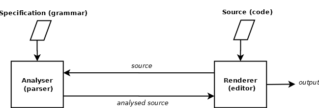

# editor-grammar

Invariant Codebase of `editor-grammar`

Used as a `git` submodule, for common invariant code, to:

* [codemirror-grammar](https://github.com/foo123/codemirror-grammar)
* [ace-grammar](https://github.com/foo123/ace-grammar)
* [prism-grammar](https://github.com/foo123/prism-grammar)
* [syntaxhighlighter-grammar](https://github.com/foo123/syntaxhighlighter-grammar)
* [highlightjs-grammar](https://github.com/foo123/highlightjs-grammar)

**see also:**

* [Abacus](https://github.com/foo123/Abacus) Computer Algebra and Symbolic Computation System for Combinatorics and Algebraic Number Theory for JavaScript and Python
* [SciLite](https://github.com/foo123/SciLite) Scientific Computing Environment similar to Octave/Matlab in pure JavaScript
* [TensorView](https://github.com/foo123/TensorView) view array data as multidimensional tensors of various shapes efficiently
* [FILTER.js](https://github.com/foo123/FILTER.js) video and image processing and computer vision Library in pure JavaScript (browser and nodejs)
* [HAAR.js](https://github.com/foo123/HAAR.js) image feature detection based on Haar Cascades in JavaScript (Viola-Jones-Lienhart et al Algorithm)
* [HAARPHP](https://github.com/foo123/HAARPHP) image feature detection based on Haar Cascades in PHP (Viola-Jones-Lienhart et al Algorithm)
* [Fuzzion](https://github.com/foo123/Fuzzion) a library of fuzzy / approximate string metrics for PHP, JavaScript, Python
* [Matchy](https://github.com/foo123/Matchy) a library of string matching algorithms for PHP, JavaScript, Python
* [Regex Analyzer/Composer](https://github.com/foo123/RegexAnalyzer) Regular Expression Analyzer and Composer for PHP, JavaScript, Python
* [Xpresion](https://github.com/foo123/Xpresion) a simple and flexible eXpression parser engine (with custom functions and variables support), based on [GrammarTemplate](https://github.com/foo123/GrammarTemplate), for PHP, JavaScript, Python
* [GrammarTemplate](https://github.com/foo123/GrammarTemplate) grammar-based templating for PHP, JavaScript, Python
* [codemirror-grammar](https://github.com/foo123/codemirror-grammar) transform a formal grammar in JSON format into a syntax-highlight parser for CodeMirror editor
* [ace-grammar](https://github.com/foo123/ace-grammar) transform a formal grammar in JSON format into a syntax-highlight parser for ACE editor
* [prism-grammar](https://github.com/foo123/prism-grammar) transform a formal grammar in JSON format into a syntax-highlighter for Prism code highlighter
* [highlightjs-grammar](https://github.com/foo123/highlightjs-grammar) transform a formal grammar in JSON format into a syntax-highlight mode for Highlight.js code highlighter
* [syntaxhighlighter-grammar](https://github.com/foo123/syntaxhighlighter-grammar) transform a formal grammar in JSON format to a highlight brush for SyntaxHighlighter code highlighter
* [MOD3](https://github.com/foo123/MOD3) 3D Modifier Library in JavaScript
* [Geometrize](https://github.com/foo123/Geometrize) Computational Geometry and Rendering Library for JavaScript
* [Plot.js](https://github.com/foo123/Plot.js) simple and small library which can plot graphs of functions and various simple charts and can render to Canvas, SVG and plain HTML
* [CanvasLite](https://github.com/foo123/CanvasLite) an html canvas implementation in pure JavaScript
* [Rasterizer](https://github.com/foo123/Rasterizer) stroke and fill lines, rectangles, curves and paths, without canvas
* [Gradient](https://github.com/foo123/Gradient) create linear, radial, conic and elliptic gradients and image patterns without canvas
* [css-color](https://github.com/foo123/css-color) simple class to parse and manipulate colors in various formats
* [PatternMatchingAlgorithms](https://github.com/foo123/PatternMatchingAlgorithms) library of Pattern Matching Algorithms in JavaScript using [Matchy](https://github.com/foo123/Matchy)
* [SortingAlgorithms](https://github.com/foo123/SortingAlgorithms) library of Sorting Algorithms in JavaScript
