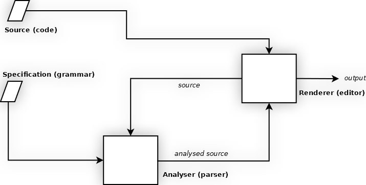

##Grammar Specification options

`Grammar.Lex` and `Grammar.Syntax` parts are similar in notation and functionality to [Parsing Expression Grammars (`PEGs`)](https://en.wikipedia.org/wiki/Parsing_expression_grammar),  [(extended) BNF](https://en.wikipedia.org/wiki/Backus%E2%80%93Naur_Form)-like notation can also be used (see below)


###Contents

* [Extra Settings](#extra-settings)
    1. [Code Folding **(new, optional)**](#code-folding)
* [Style Model](#style-model)
* [Fold Model **(not available)**](#fold-model)
* [Lexical Model](#lexical-model)
    1. [Simple Tokens](#simple-tokens)
    2. [Block Tokens](#block-tokens)
    3. [Action Tokens **(new)**](#action-tokens)
    4. [Lex shorthand type annotations **(new, optional)**](#lex-shorthand-type-annotations)
* [Syntax Model **(optional)**](#syntax-model)
    1. [Syntax PEG/BNF-like notations **(new)**](#syntax-pegbnf-like-notations)
* [Parser](#parser)
* [Modularity and Future Directions](#modularity-and-future-directions)


###Extra Settings

* `Grammar.RegExpID` defines the prefix `ID` for any regular expressions (represented as strings) used in the grammar

The first character after the `RegExpID` is considered the regular expression delimiter (similar to php regex usage), in this way *regular expression flags* can be added (mostly the case-insensitive flag `i` )


example:
```javascript

"RegExpID" : "RegExp::"

// .. various stuff here

"aToken" : "RegExp::/[abc]+/i", // define a regular expression /[abc]+/i, or [abc]+ with case-insensitive flag
// note: the delimiters ( /, / ) are NOT part of the regular expression
// regular expression syntax and escaping is same as regexs defined with new RegExp() object in javascript

"anotherToken" : "RegExp::#[def]+#i", // define a regular expression /[def]+/i, or [def]+ with case-insensitive flag
// note: other delimiters are used ( #, # )

// .. other stuff here

```

* `Grammar.Extra` defines any (editor-specific) extra settings (eg. `electricChars`, `fold`, etc..) to be added to the generated mode, and is a map of the form:

`editor_specific_setting_id  -> editor_specific_setting_value`


####Code Folding
**(new, optional)**

Generic, editor-independent, code folding functionality is supported (by generic folders implementations).

Add a `fold` type in the `Grammar.Extra."fold"` option.

**Generic Folding Types supported:**

* `"brace"` / `"cstyle"` , folds on braces (i.e `{}`) and brackets (i.e `[]`)
* `"indent"` / `"indentation"` , folds on blocks delimited by same indentation (e.g as in `python`)
* `"markup"` / `"xml"` / `"html"` , folds based on `xml`/`markup` tags and `CDATA` blocks
* **NOTE** folding `"block"`-type comments, if existing and defined as such, is done automaticaly, no need to add separate folder option


**NOTE** One may use multiple different code-folders, combined with `+` operator.


For example:

```javascript
"Extra"         : {
    // combine multiple code folders in order by "+",
    // here both indentation-based and brace-based (each one will apply where applicable, in the order specified)
    "fold"      : "indentation+brace"
}
```


###Style Model

`Grammar.Style` Model defines the mapping of tokens to editor styles and is a map of the form:

`token_id  -> editor_specific_style_tag`


###Fold Model
**(not available)**

In future, support a parametrisable `Grammar.Fold` Model which can parametrise code folders
for user-defined custom code folding (see [above](#code-folding)).


###Lexical Model

`Grammar.Lex` Model defines the mapping of token patterns and token configuration to an associated `token_id` and is a map of the form:

`token_id  -> token_configuration_object`


`token configuration` can be:

* a `pattern` or `array of patterns`
* an `object` having at least (some or all of) the following `properties` :
    1. `"type"`   : `token` `type` (default `"simple"` )
    2. `"msg"`    : `token` `error message` (default `token default error message` )
    3. `"tokens"` : `pattern` or `array of patterns` for this token
    4. `properties` depending on `token type` (see below)
    5. *optionaly*, token `"type"` can be **annotated inside** the `token_id` ([see below](#lex-shorthand-type-annotations))

* a token type can be `"simple"` (default), `"block"`, `"line-block"`,  `"escaped-block"`, `"escaped-line-block"`, `"comment"`, `"action"`
* a token can *extend / reference* another token using the `extend` property; this way 2 tokens that share common configuration but different styles (depending on context) can be defined only once. Examples are tokens for `identifiers` and `properties` While both have similar tokenizers, the styles (and probably other properties) can be different (see [syntax notations](#syntax-pegbnf-like-notations) for a **more convenient and more flexible alternative**).

```javascript

// Style
//
// .. stuff here..

"identifier" : "style1",
"property"   : "style2",

// ..other stuff here..


// Lex
//
// .. stuff here..

"identifier": "RegExp::/[a-z]+/",

"property": {
    "extend" : "identifier" // allow property token to use different styles than identifier, without duplicating everything
},

// ..other stuff here..

```


####Simple Tokens

* a literal `null` valued token matches up to 'end-of-line' ; can be useful when needing to match remaining code up to end-of-line (e.g see single-line comments below)

* a literal `false` or `0` valued token matches `empty production` ; can be useful in defining syntax sequences that can repeat (can be used as alternative to `"zeroOrMore"`, `"oneOrMore"` group types, plus give a familiar feel to defining rule productions )

* a literal `empty string` token (  `''`  ) matches `non-space` ; can be useful when multiple tokens should be consecutive with no space between them

* a literal `string` becomes a token (eg inside `Syntax` Model sequence) with a `tokenID` same as its `literal value`

* a token can be defined using just the `token_id` and the token pattern(s); token type is assumed `"simple"`
* multiple `"simple"` tokens (which are NOT regular expresions) are grouped into one regular expression by default using `"\\b"` (word-boundary) delimiter; this is usefull for speed fine-tuning the parser, adding the `"combine"` property in the token configuration, can alter this option, or use a different delimiter
* `"simple"` tokens can also be used to enable *keyword autocomplete functionality* (`"autocomplete":true`, option )


####Block Tokens

* `"block"`, `"line-block"`, `"escaped-block"`, `"escaped-line-block"`, `"comment"` token types take pairs of patterns `[start-pattern, end-pattern]`

* if `"end-pattern"` is missing, `"end-pattern"` is same as `"start-pattern"`

* if `"end-pattern"` has the (literal) value `null` , `"end-pattern"` matches what remains up to `end-of-line` (eg. in single line comment blocks)

* if `"end-pattern"` is a `string` , it can contain [special string replacement patterns](https://developer.mozilla.org/en-US/docs/Web/JavaScript/Reference/Global_Objects/String/replace#Specifying_a_string_as_a_parameter), the `"end-pattern"` will be generated dynamically from the respective `"start-pattern"` by replacement (provided `start-pattern` is a regex), make sure to properly escape literal `"$"` values in order to match them correctly (see previous link)

* if `"end-pattern"` is a `number` , then the `"end-pattern"` is generated dynamically from the respective `"start-pattern"` match group (provided `start-pattern` is a regex)

* `"escaped-block"`, `"escaped-line-block"` type is a `"block"` which can contain its `"end-pattern"` if it is *escaped* , `"strings"` are classic examples

* `"block"`, `"comment"`, `"escaped-block"` can span multiple lines by default, setting the `"multiline": false` option can alter this

* `"escaped-line-block"`, `"line-block"` type is a `"block"` which can span only a single line (`"multiline":false`)

* `"escaped-block"`, `"escaped-line-block"` by default uses the `"\\"` escape character, setting the `"escape": escChar` option, can alter this

* `"comment"` type is a `"block"` type with the additional **semantic** information that token is about comments, so *comment toggle functionality* and *comment interleave functionality* can be enabled

* `"comment"` type can be *interleaved* inside other syntax sequences automatically by the parser (`"interleave": true`, token option) (the comment token should still be added in `grammar.Parser` part ), else *comment interleaving could be handled manually* in the `grammar.Syntax` part

* all block-type tokens can have *different styles* for `block delimiters` and `block interior` (see examples), for example having a block token with ID `"heredoc"` , the interior different style can be represented in `Style` part of grammar as `"heredoc.inside"` (make sure your token `IDs` do not accidentally match this option)


####Action Tokens 
**(new, experimental)**

`Action` tokens enable the grammar parser to perform some extra context-specific parsing functionality on tokens.
An `action` token in a grammar **applies only and directly to the token preceding it**. It performs an **action on that token only**.

* `"action"` tokens can `push` or `pop` string `IDs` onto the data stack generated from the (preceding) matched token, for example *associated tag mathing* can be done this way, (see `test/grammars/xml.js` for an example)

* `"action"` tokens can `check` the (preceding) matched token is unique, for example *unique identifiers checking* can be done this way, (see `test/grammars/xml.js` for an example)

* `"action"` tokens can `start` (`"context":true`) and `end` (`"context":false`) a new dynamic `context` so succesive actions take place in that context, for example *unique object literal properties* and *unique xml tag attributes* can be done his way, (see `test/grammars/xml.js` for an example)

* `"action"` tokens can generate a hard `error` in context (`"error":"error message"`), for example **special syntax errors** can be modeled, in the grammar, as needed, if needed, (see `test/grammars/xml.js` for an example)

* .. more actions to be added like `indent`/`outdent` etc..

* multiple `"action"` tokens in sequence are applied to **the same preceding token**


**Example:**
```javascript

// stuff here..

"match" : {
    // this will push a token ID generated from the matched token
    // it pushes the matched tag name (as regex group 1)
    // string replacement codes are similar to javascript's replace function
    "type" : "action",
    "push" : "<$1>"
},

"matched" : {
    // this will pop a token ID from the stack
    // and try to match it to the ID generated from this matched token
    // it pops and matches the tag name (as regex group 1)
    // string replacement codes are similar to javascript's replace function
    
    // note 1: the ID has similar format to the previously pushed ID
    // any format can be used as long as it is consistent (so matching will work correctly)
    
    // note 2: a "pop" : null or with no value, pops the data unconditionally (can be useful sometimes)
    
    "type" : "action",
    "pop" : "<$1>", 
    "msg" : "Tag \"$1\" does not match!"
}

// other stuff here..

// syntax part

"start_tag": "open_tag match tag_attribute* close_open_tag",
"end_tag": "close_tag matched",

// other stuff here..

```

####Lex shorthand type annotations
**(new, optional)**

Lexical tokens can annotate their `type` in their `token_id` as `"token_id:token_type"` for *convenience*.

**Example:**
```javascript


"a_token:comment": [["<--", "-->"]]
// is equivalent to =>
"a_token": {
    "type": "comment",
    "tokens": [["<--", "-->"]]
}


"a_token:action": {"push":"$1"}
// is equivalent to =>
"a_token": {
    "type": "action",
    "push": "$1"
}

// and so on..

```


###Syntax Model
**(optional)**

`Grammar.Syntax` Model defines the mapping of token context-specific sequences to an associated `composite_token_id` and is a map of the form:

`composite_token_id  -> composite_token_configuration_object`


* Inside the `Syntax` Model, *(single) tokens* can also be defined (similar to `Lex` part), however it is recommended (single) tokens be defined in `Lex` part

* `Syntax` includes *special token types* (like generalised regular expressions for composite token sequences, or parsing expressions in the style of `PEG`s)

* `Syntax` token `"type"` can be: `"alternation"`,`"sequence"`,`"zeroOrOne"`,`"zeroOrMore"`,`"oneOrMore"`,`"repeat"` ; these tokens contain sequences of subtokens (`"tokens"`) to be matched according to some scheme

* types:
    1. `"type":"repeat"`,`"repeat":[min, max]`,  match any of the tokens a minimum `min` times and a maximum `max` times else error (analogous to a regex: `(t1 | t2 | t3..){min, max}` , where `t1`, `t2`, etc are also composite tokens)
    2. `"type":"zeroOrOne"`,  match any of the tokens `zero or one` times (analogous to a regex: `(t1 | t2 | t3..)?` , where `t1`, `t2`, etc are also composite tokens)
    3. `"type":"zeroOrMore"`,  match any of the tokens `zero or more` times (analogous to a regex: `(t1 | t2 | t3..)*` , where `t1`, `t2`, etc are also composite tokens)
    4. `"type":"oneOrMore"`,  match any of the tokens `one or more` times (analogous to a regex: `(t1 | t2 | t3..)+` , where `t1`, `t2`, etc are also composite tokens)
    5. `"type":"alternation"`,  match any of the tokens (analogous to a regex: `(t1 | t2 | t3..)` , where `t1`, `t2`, etc are also composite tokens)
    6. `"type":"sequence"`,  match all the tokens in sequence (analogous to a regex: `(t1 t2 t3 ..)` , where `t1`, `t2`, etc are also composite tokens) else error

* a syntax token can contain (direct or indirect) `recursive references` to itself ( **note:** some rule factoring may be needed, to avoid grammar `left-recursion` or `ambiguity` )

* a `"ngram"` or `"n-gram"` syntax token type, is similar to a `"type":"sequence"` type, with the difference that it is **only matched optionally** (suitable to be used in `grammar.Parser` part)

* a syntax token  in `Parser` that it wrapped in `[..]` (i.e as an `array`), is shorthand notation to interpret it as an `n-gram`-type token (for *convenience of notation*, one can see it in various example grammars)

* It is recommended to have only `Lex.tokens` or `Syntax.ngrams` in ther `grammar.Parser` part and not `Syntax.group` tokens which are mostly *auxilliary*

* The `grammar.Syntax` part is quite general and flexible and can define a complete language grammar, however since this is for syntax highlighting and not for code generation, defining only necessary syntax chunks can be lighter


####Syntax PEG/BNF-like notations
**(new)**

`Syntax` part supports *shorthand definitions* (similar to `PEG` / `BNF` -style definitions) for syntax sequences and groups of syntax sequences (see below).


**Note:** In order for a (grammar) specification for (programming) language highlight to be detailed and self-contained (to be re-usable and flexible under the most general conditions), it should model all available types of tokens which play a part in the code and the way it is highlighted (usualy not modeled by other approaches or other grammar specifications), for example: 


* `<start-of-file>` token (modeled as `^^`, see below)
* `<first-non-blank-line>` token (modeled as `^^1`, see below)
* `<start-of-line>` token (modeled as `^`, see below)
* `<end-of-line>` token (modeled as `$`, see below)
* `<up-to-line-end>` token (modeled as `null`, see above, `block` tokens)
* `<non-space>` token (modeled as `''`, see below)
* `<indentation>` token (not available yet)
* `<de-indentation>` token (not available yet)
* and so on..


Specificaly:

```javascript
"t": "t1 | t2 | t3"
// is equivalent to =>
"t": {
    "type": "alternation",
    "tokens": ["t1", "t2", "t3"]
}


"t": "t1*"
// is equivalent to =>
"t": {
    "type": "zeroOrMore",
    "tokens": ["t1"]
}


"t": "t1+"
// is equivalent to =>
"t": {
    "type": "oneOrMore",
    "tokens": ["t1"]
}


"t": "t1?"
// is equivalent to =>
"t": {
    "type": "zeroOrOne",
    "tokens": ["t1"]
}


"t": "t1{1,3}"
// is equivalent to =>
"t": {
    "type": "repeat",
    "repeat": [1,3], // match minimum 1 times and maximum 3 times
    "tokens": ["t1"]
}


"t": "t1* | t2 | t3"
// is equivalent to =>
"t1*": {
    "type": "zeroOrMore",
    "tokens": ["t1"]
},
"t": {
    "type": "alternation",
    "tokens": ["t1*", "t2", "t3"]
}

"t": "t1* t2 | t3"
// is equivalent to =>
"t1*": {
    "type": "zeroOrMore",
    "tokens": ["t1"]
},
"t1* t2": {
    "type": "sequence",
    "tokens": ["t1*", "t2"]
},
"t": {
    "type": "alternation",
    "tokens": ["t1* t2", "t3"]
}

// tokens can be grouped using parentheses
"t": "(t1 t2)* | t3"
// is equivalent to =>
"t1 t2": {
    "type": "sequence",
    "tokens": ["t1", "t2"]
}
"(t1 t2)*": {
    "type": "zeroOrMore",
    "tokens": ["t1 t2"]
}
"t": {
    "type": "alternation",
    "tokens": ["(t1 t2)*", "t3"]
}


// literal tokens wrapped in quotes (' or ") (e.g 'abc') are equivalent to their literal value (i.e abc)

// literal tokens wrapped in brackets (e.g [abc]) are equivalent to matching any of the enclosed characters (like in regular expressions)

// note: LIKE REGULAR EXPRESSIONS having ^ first in a character selection, e.g [^abc] provides a NEGATIVE match
// note2: the PEG features
// 1. negative lookahead feature (i.e not-predicate !t)
// 2. positive lookahead feature (i.e and-predicate &t)
// are currently NOT supported

// regular expressions can also be defined inside a syntax rule, using /../[i] format, e.g /abc/,  /abc/i 
// this will create a new simple token (with token_id=/abc/i) which is a regular expression
// using a dotted-style modifier, on the regex defined this way, can style it dynamicaly (see below), e.g /abc/i.style1

// empty literal token w/ quotes (i.e '') matches NON-SPACE production (i.e fails if space is encountered)
// zero literal token w/o quotes (i.e 0) matches EMPTY production (i.e succeeds always)

// ^^ literal token w/o quotes (i.e ^^) matches SOF (i.e start-of-file, first line of code)
// ^^1 literal token w/o quotes (i.e ^^1) matches FNBL (i.e first non-blank line of code)
// ^ literal token w/o quotes (i.e ^) matches SOL (i.e start-of-line, any line)
// $ literal token w/o quotes (i.e $) matches EOL (i.e end-of-line, any line, along with any extra space)

// e.g
"t": "t1 '=' t2"
// is equivalent to =>
"t_equal": {
    "type": "simple",
    "tokens": "="
},
"t": {
    "type": "sequence",
    "tokens": ["t1", "t_equal", "t2"]
}

// any (simple or composite) token followed by a dotted-style modifier, uses this style in context
// for example, the token "t3", below, will be styled differently depending on context
// i.e whether it comes after "t1" or after "t2"

// ..
// Style..
"Style": {
    "style1": "an-editor-style",
    "style2": "another-editor-style"
}

// ..
// Syntax..

"t": "t1 t3.style1 | t2 t3.style2"

// style modifier for composite tokens also works
// i.e below both "t2" and "t3" tokens will be styled with "style1", if after "t1"
// note: ".style1" overrides internal "t2.style2" modifier as well

"t": "t1 (t2.style2 t3).style1"


// and so on..
// ..
```


###Parser

`Grammar.Parser` defines what to parse and in what order ( **only patterns** defined in this part of the `grammar` will **actually be parsed** , everything else is `auxilliary` )


* a syntax token used in the `parser`, which is enclosed in brackets `[..]`, i.e as an `array`, is interpreted as an `n-gram`-type token (see syntax part, above). This is used for *convenience ans succintness of notation*, instead of creating  separate `n-gram` token(s), for use in the `parser` part


###Modularity and Future Directions

The model envisioned for modular highlighting is shown below:




1. User specifies a `specification` (a `grammar` model) for a language
2. The specification along with the source code (to be highlighted) is passed to the `analyser` (`parser`), which uses the specification to analyse the code and extract data (see below)
3. The analysed code data and the source code are passed to the `renderer` (`editor`, e.g `codemirror`, `ace`,..) which renders the code and interacts with the user

More or less this model is used now by highlight editors (e.g `codemirror`, `ace`, ..) however it is not modular.
The new `specification-analyser-renderer model` has the following features / advantages:

1. Specification is at the same time both **concise** and **detailed, self-contained** (this is achieved by modeling all necessary features of a language in a symbolic way, see below).
2. Specifications can be **extended / merged / combined** to **construct new specifications** for variations, dialects, composite languages, with minimum effort (this is achieved by the appropriate format for a specification and how/what it models, see below).
3. The model is **based on interfaces** for analyser and renderer, while (underlying) implementations can vary as needed. This **decouples highlighting specifications from underlying implementations** and differences between platforms,editors,languages and so on..
4. Optionaly, a specification can be **directly transformed into hard code** (highlight mode source code for a language) and be used directly (in place of analyser) without re-doing the first 2 stages (`specification - analyser`).


The format for a specification should be such that is widely supported, is textual or also has a equivalent strictly-textual representation, is concise, and enables composition operations. `JSON` is such a format (and ubiquitous in javascript-based projects) and is the format used by the `grammar` (`specification`).

In order for a (grammar) specification for (programming) language highlight to be detailed and self-contained (to be re-usable and flexible under the most general conditions), and also concise, it should model all available types of tokens/actions which play a part in the code and the way it is highlighted (usualy not modeled by other approaches or other grammar specifications).

For example (see above): 


* `<start-of-file>`, `<start-of-line>`, `<end-of-line>` token
* `<first-non-blank-line>`, `<up-to-line-end>` token
* `<non-space>`, `<indentation>`, `<dedentation>` token
* `<block>`, `<delimited>` token (e.g in the sense that `comments`, `strings`, `heredocs`,.. are delimited, block tokens)
* and so on..
    
    

* handle arbitrary, user-defined, toggle comments and keyword autocompletion functionality (achieved by semanticaly annotating language `comments` and `keywords`)
* handle arbitrary, user-defined, lint-like syntax-annotation functionality (achieved by modeling language `syntax` analysis except strictly `lexical` analysis, in-context)
* handle arbitrary, user-defined, code `folding` (e.g via `fold action` token or via a `Fold` Model, see above)
* handle arbitrary, user-defined, code `(out-)indentation` (e.g via `indent action` token or via an `Indentation` Model)
* handle arbitrary, user-defined, code `matching` (e.g `brackets`, `tags`, etc..) via `match action` token
* handle arbitrary, user-defined, dynamic contexts via `context action` token
* handle arbitrary, user-defined, unique identifiers via `unique action` token
* handle arbitrary, user-defined, `(operator) precedence` relations via `precedence action` token
* handle arbitrary, user-defined, `local/global/scoped` relations via `scope action` token
* and so on..


The difference between `<indentation>` token and `<indent>` action token (although related) is that the `indentation` token **recognizes** indentations and indentation changes (that may signal a code block, for example like braces do), while an `indent` action token **creates** dynamic indentation (e.g by inserting `indentation` tokens, or symbols to be recognised by `indentation` tokens).
